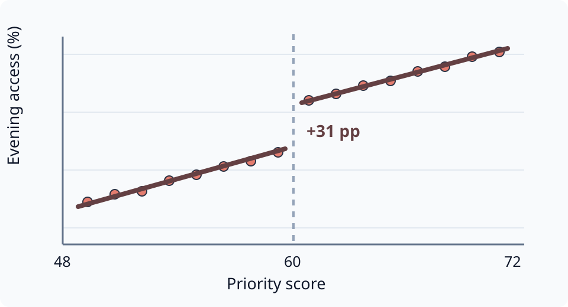
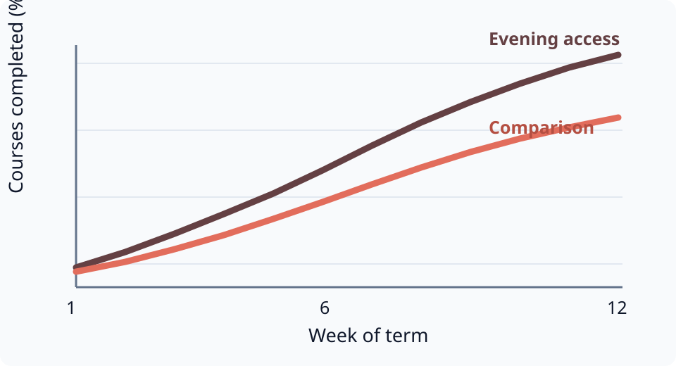
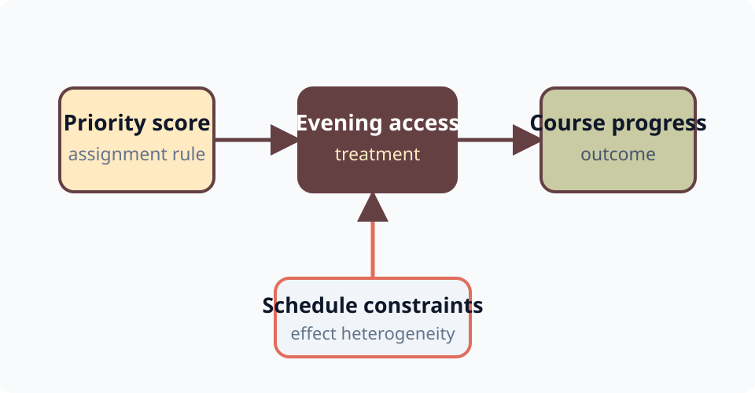
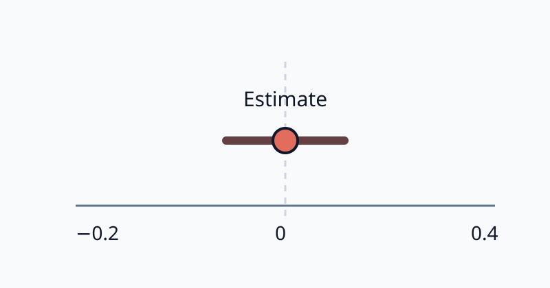
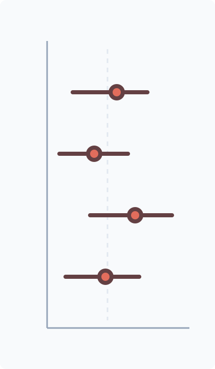
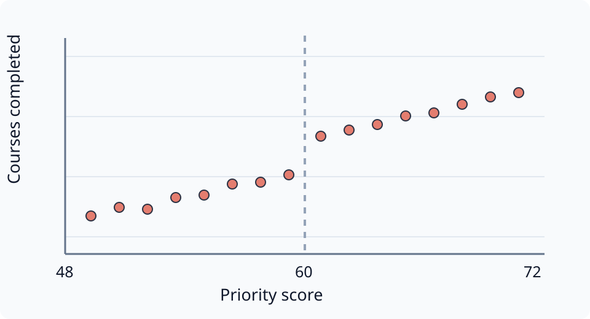
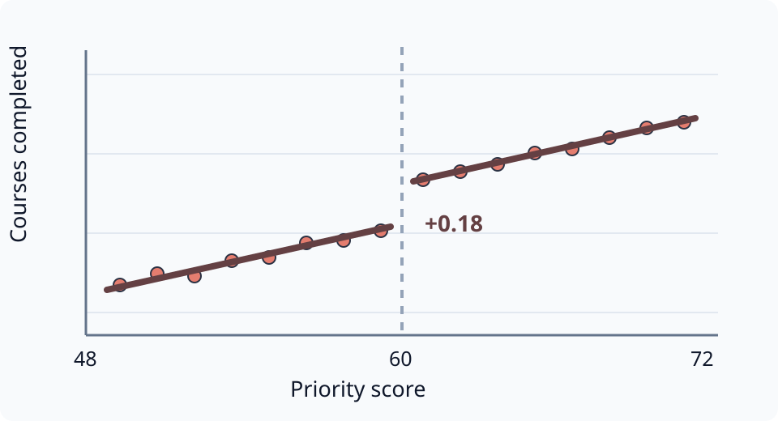

## Why evening study space? {#motivation}

- Many students combine full-time study with paid work and caring responsibilities.
- Quiet study space is scarce precisely when flexible students can use it.
- A score-based access rule creates a useful synthetic experiment.

  - The threshold is known in advance.
  - Students cannot precisely manipulate their score.
  - Administrative records follow outcomes for four terms.

::: {.aside}
Every institution, observation, citation, and estimate in this deck is
synthetic. The citation line is intentionally long enough to exercise wrapping.
:::

::: notes
Open with the constraint, not the design. The point of this fixture is that a
real speaker note remains available to presenter view and Slide Remote, then
appears in the handout PDF.
:::

## Question and preview {#question-and-preview}

Does reliable evening access help students make progress?

::: {.incremental}
1. Access rises sharply at the eligibility threshold.
2. Course completion improves during the first two terms.
3. The effect is concentrated among students with inflexible schedules.
:::

::: {.live-only}
> A live-only prompt for the room: what sign would you expect, and why? This
> blockquote sits in `::: {.live-only}`, so it never reaches the handout.
:::

::: {.handout-only}
A `.handout-only` reading note: wrap any block in `::: {.handout-only}` to add
guidance that appears only in `?handout=true` and the handout PDF, where the
live deck shows a discussion prompt instead.
:::

::: notes
Fragments must collapse to one final-state page in both PDF variants.
:::

# Setting and data

A SIMPLE RULE, A LINKED PANEL, AND A SHARP THRESHOLD

## The access rule {#access-rule}

:::: {.columns}
::: {.column width="32%"}
- Applicants receive a priority score from 0 to 100.
- Evening access is offered when $s_i \geq 60$.
- Capacity and opening hours are fixed for the term.[^assignment]
:::
::: {.column width="68%"}
{fig-alt="Synthetic score distribution and access jump at a threshold of sixty"}
:::
::::

[^assignment]: The fictional rule is deterministic within each application round.

## The space itself {.full-bleed background-image="assets/field.svg" background-size="cover" #study-space}

Reading rooms stay open until midnight during teaching terms.

A `.full-bleed` slide: `background-image` fills the canvas, the title and
these captions ride on scrim chips, and the credit is a `.attribution` div.

::: {.attribution}
Synthetic dusk scene · generated illustration, not a photograph
:::

## A descriptive pattern {#descriptive-pattern}

{.r-stretch fig-alt="Synthetic completion paths for students with and without evening access"}

::: {.aside}
Descriptive paths are not causal. Values are percentages in a fully synthetic
panel constructed only to test a labelled research figure.
:::

::: {.slide-nav}
[Alternative outcome](#appendix-alternative)
:::

## Synthetic sample {#synthetic-sample}

| Sample step | Students | Share retained |
|:------------|---------:|---------------:|
| Applications received | 12,480 | 100% |
| Valid priority score | 11,932 | 96% |
| Within bandwidth | 4,216 | 34% |
| Linked to outcomes | 4,087 | 33% |

- The running variable is stored as `priority_score`.
- Outcomes come from a linked four-term panel.

::: {.aside}
Synthetic administrative records, deliberately formatted like a compact
research-table source note.
:::

## The sample at a glance {#sample-at-a-glance}

::: {.stat-row}
[12,480]{.stat} applications received

[4,087]{.stat} students within bandwidth

[4]{.stat} terms of linked outcomes
:::

A `.stat-row` keeps up to three magnitudes readable from the back of a seminar
room. Each pair is one paragraph inside `::: {.stat-row}`, number first:
`[4,087]{.stat} students within bandwidth`.

# Research design

LOCAL COMPARISONS AROUND A PRE-ANNOUNCED ACCESS RULE

## From score to access {#assignment-pathway}

{fig-alt="A pathway from priority score through evening access and study time to course progress"}

::: {.attribution}
Synthetic design diagram · arrows encode the estimand, not empirical findings
:::

::: notes
The attribution is a direct slide child so it stays compatible with Reveal
plugins and does not collide with the footer.
:::

## Estimating equations {#estimating-equations}

**First stage**

$$
\begin{aligned}
D_{it} &= \pi_0 + \pi_1 \operatorname{Above}_{it}
  + f_-(r_{it}) + f_+(r_{it}) \\
&\quad + \lambda_t + u_{it}
\end{aligned}
$$

**Second stage**

$$
\begin{aligned}
Y_{it} &= \alpha + \beta \widehat{D}_{it}
  + g_-(r_{it}) + g_+(r_{it}) \\
&\quad + \delta_t + \varepsilon_{it}.
\end{aligned}
$$

::: {.slide-nav}
[First stage: $\widehat{\pi}_1$](#first-stage)
:::

## What must hold {#what-must-hold}

::: {.callout-note title="Estimand"}
$\beta$ is the local average effect of evening access for applicants at the
margin of eligibility, $r_i = 0$.
:::

::: {.callout-important title="Identifying assumption"}
Potential outcomes are continuous in the priority score at the threshold:
nothing but access changes discontinuously at $s_i = 60$.
:::

::: {.callout-warning title="Caveat"}
Continuity is not testable directly; the diagnostics on the next slides probe
its observable implications.
:::

::: {.aside}
Semantic boxes are Quarto callouts restyled by the theme: `.callout-note`
defines, `.callout-tip` states results, `.callout-important` holds
assumptions, and `.callout-warning` flags caveats.
:::

## First stage: access at the cutoff {#first-stage}

{.r-stretch fig-alt="Synthetic regression discontinuity plot with a large access jump at the threshold"}

- Access increases by **31 percentage points** at the threshold.
- The first-stage interval excludes zero in every bandwidth shown.

::: {.slide-nav}
[Estimating equations](#estimating-equations){.back}
:::

## Design diagnostics {#design-diagnostics}

:::: {.columns}
::: {.column width="50%"}
**Predetermined outcomes**

{fig-alt="Synthetic diagnostic estimate with a confidence interval"}
:::
::: {.column width="50%"}
**Covariate balance**

{fig-alt="Synthetic dot-and-whisker balance estimates"}
:::
::::

[Main result](#main-effect) · [Placebo](#appendix-placebo)

## Specification details {#specification-details}

- $r_{it} = s_{it} - 60$ is the centered score; $\operatorname{Above}_{it}=\mathbf{1}[r_{it}\geq0]$.
- Local linear fits are estimated separately on either side of the cutoff.

  - Preferred bandwidth: $|r_{it}|<12$.
  - Application-round fixed effects absorb common shocks.
  - Standard errors are clustered by student.

- The estimand is local: $\beta = \mathbb{E}[Y_i(1)-Y_i(0)\mid r_i=0]$.

# Results

EFFECTS, UNCERTAINTY, AND USEFUL ALTERNATIVES

## Outcomes around the threshold {#outcome-buildup}

::: {.r-stack}
{width="1150" fig-alt="Synthetic binned course completion by priority score"}

{.fragment width="1150" fig-alt="The same binned outcomes with local linear fits and the estimated jump"}
:::

::: {.aside}
A figure build-up: images stacked in `::: {.r-stack}`, later layers tagged
`{.fragment}`. Layers share the same base image, so each step reads as adding
to the plot.
:::

::: notes
The fit layer shares the points layer's base, so the fragment reads as adding
the fit. PDFs keep only the final state.
:::

## Main effect after two terms {#main-effect}

::: {.columns}
::: {.column width="56%"}
{fig-alt="Synthetic main estimate with a confidence interval"}
:::
::: {.column width="44%"}
- Point estimate: **0.18 courses**
- 95% interval: **0.07–0.29**
- Pre-specified primary outcome
- $N=4{,}087$ students
:::
:::

::: {.aside}
Illustrative values only. This box is a `::: {.aside}`: it reserves its space
in live slides and stacks above the speaker note in handout mode.
:::

::: notes
Pause on the interval before discussing magnitude. This is the canonical
figure-plus-aside-plus-note handout regression.
:::

::: {.slide-nav}
[Design](#estimating-equations){.back}
[Dynamics](#effects-over-time)
[Robustness](#robustness-summary)
:::

## The headline result {.statement #headline-result}

::: {.stat-row}
[**+0.18**]{.stat} courses completed per term at the threshold
:::

Reliable evening access moves real course progress for marginal applicants —
in fully synthetic data.

::: {.aside}
A statement slide: add `{.statement}` to the heading, which becomes the
kicker. The number is `[**+0.18**]{.stat}` inside a `::: {.stat-row}`; bold
gives it the accent ink.
:::

## Effects over time and outcomes {#effects-over-time}

:::: {.columns}
::: {.column width="50%"}
**Course completion**

{fig-alt="Synthetic dynamic effects on course completion"}
:::
::: {.column width="50%"}
**Credits earned**

{fig-alt="Synthetic estimate for credits earned"}
:::
::::

[Main result](#main-effect){.back} · [Alternative outcome](#appendix-alternative)

## A possible pathway {#possible-pathway}

:::: {.columns}
::: {.column width="42%"}
- Evening access increases usable study time.
- The largest gains appear for students with inflexible schedules.
- This pattern is suggestive, not a separately identified mechanism.
:::
::: {.column width="58%"}
{fig-alt="Synthetic pathway through evening access and study time"}
:::
::::

::: {.slide-nav}
[Mechanism check](#appendix-mechanism)
:::

## Robustness summary {#robustness-summary}

| Specification | Estimate | Standard error | $N$ |
|:--------------|---------:|---------------:|----:|
| Baseline | [0.18]{.emph} | 0.06 | 4,087 |
| Narrow bandwidth | 0.20 | 0.08 | 2,744 |
| Donut specification | 0.17 | 0.07 | 3,801 |
| Covariate adjustment | 0.18 | 0.06 | 4,087 |

::: {.table-note}
Standard errors clustered by student · this source line is a `.table-note`
div, and the boxed coefficient above is `[0.18]{.emph}`.
:::

::: {.slide-nav}
[Main result](#main-effect){.back}
[Placebo](#appendix-placebo)
[Alternative outcome](#appendix-alternative)
:::

## Heterogeneity by baseline schedule {#heterogeneity}

| Subgroup, by baseline schedule flexibility | Estimate | Standard error | Share of sample |
|:-------------------------------------------|---------:|---------------:|----------------:|
| Inflexible schedule (work or care obligations) | [0.27]{.emph} | 0.09 | 31% |
| Partially flexible schedule | 0.16 | 0.07 | 42% |
| Fully flexible schedule | 0.09 | 0.08 | 27% |

::: {.table-note}
Estimates come from the baseline specification interacted with the
schedule-flexibility indicator recorded at application; standard errors are
clustered by student. A wide table like this one shows how a paired
`.table-note` spans the full table width and left-aligns instead of wrapping
into a narrow centered stack.
:::

## What the design identifies {.dark-bg background-color="#1e293b" #design-identifies}

> Near the threshold, access changes sharply while observed student
> characteristics change smoothly.

::: {.incremental}
- The estimate is local to marginal applicants.
- It combines access, opening hours, and the option value of a quiet room.
- It does not identify the effect of studying one additional hour.
:::

## Scope condition {.light-bg background-color="#ffeac2" #scope-condition}

- The mock institution has scarce evening capacity and a transparent rule.
- Effects may differ when:

  - access is universal;
  - online resources are close substitutes; or
  - students can precisely manipulate assignment.

The [design notes](https://quarto.org/docs/presentations/revealjs/) link remains
distinguishable without requiring a network request to render the deck.

# Conclusion

WHAT THE SYNTHETIC EXERCISE WOULD SUPPORT

## Three takeaways {#three-takeaways}

1. A transparent threshold creates a credible local comparison.
2. Evening access raises short-run course progress in the mock data.
3. Schedule constraints provide a plausible—but not separately identified—pathway.

::: {.callout-tip title="Result"}
At the margin of eligibility, evening access raises completion by 0.18
courses per term over the first two terms.
:::

::: {.attribution}
`altmejd-slides` canonical showcase · all results synthetic
:::

::: notes
Return to the opening constraint, then state the scope condition once.
:::

## Thank you {.closing-slide #thanks}

adam\@altmejd.se · [adamaltmejd.se](https://adamaltmejd.se)

Draft, slides, and replication code: [github.com/adamaltmejd](https://github.com/adamaltmejd)

A closing slide: `## Thank you {.closing-slide}` with contact lines; the code
in the corner is generated from `[alt text](url){.qr}` at render time.

[QR code linking to adamaltmejd.se](https://adamaltmejd.se){.qr}

# Appendix

BACKUP CHECKS AND IMPLEMENTATION DETAILS

## Alternative outcome: credits earned {#appendix-alternative}

{.r-stretch fig-alt="Synthetic estimate for credits earned"}

::: {.aside}
Navigation chips: internal links inside `::: {.slide-nav}`. Add `{.back}` to
the return link and `{.primary}` only to the one emphasized action.
:::

::: {.slide-nav}
[Descriptive pattern](#descriptive-pattern){.back} ·
[Main effect](#main-effect){.primary} ·
[Dynamics](#effects-over-time) ·
[Narrow bandwidth](#robustness-summary) ·
[Donut specification](#appendix-placebo) ·
[Schedule pathway](#appendix-mechanism) ·
[Specification](#reproducible-specification)
:::

## Bandwidth sensitivity {#appendix-bandwidth}

::: {.figure-panels}
::: {.figure-panel}
**Estimates across bandwidths**

{fig-alt="Synthetic estimates across alternative bandwidths"}
:::
:::

::: {.aside}
An explicit one-panel layout: `::: {.figure-panels}` with a single
`::: {.figure-panel}` child whose `**bold**` first line is the panel label.
Two-image column pairs upgrade to this layout automatically.
:::

::: {.slide-nav}
[Robustness summary](#robustness-summary){.back}
:::

## Placebo outcome and reserved footer {#appendix-placebo}

:::: {.columns}
::: {.column width="50%"}
**Before assignment**

{fig-alt="Synthetic pre-assignment placebo estimate"}
:::
::: {.column width="50%"}
**Unrelated outcome**

{fig-alt="Synthetic unrelated-outcome estimates"}
:::
::::

::: {.aside}
Both placebo intervals include zero. This multi-line aside must remain above
the navigation row while both figure panels retain useful height.
:::

::: {.slide-nav}
[Robustness summary](#robustness-summary){.back}
:::

## Mechanism check: inflexible schedules {#appendix-mechanism}

{.r-stretch fig-alt="Synthetic heterogeneous estimates by schedule flexibility"}

::: {.aside}
Groups are defined before assignment. Higher values indicate less schedule
flexibility; all quantities are synthetic.
:::

::: notes
The direct-child order is media, visible aside, note, then navigation in the
handout even though navigation appears earlier in the source on other slides.
:::

::: {.slide-nav}
[Possible pathway](#possible-pathway){.back}
[Main effect](#main-effect)
:::

## Reproducible specification {#reproducible-specification}

```{.r code-line-numbers="1-2|3-5|6"}
sample <- applicants[abs(priority_score - 60) < 12, ]
sample$above <- sample$priority_score >= 60
first_stage <- lm(access ~ above * centered_score, data = sample)
outcome <- lm(courses_completed ~ fitted(first_stage), data = sample)
interval <- confint(outcome, "fitted(first_stage)")
c(estimate = coef(outcome)[2], lower = interval[1], upper = interval[2])
```

::: notes
This is inert illustrative code. Handout mode must not leave non-selected lines
dimmed, and PDF export must keep only the final highlighted state.
:::

::: {.slide-nav}
[Alternative outcome](#appendix-alternative){.back}
:::

## Design contract {.light-bg background-color="#f1f5f9" #design-contract}

This compact deck now exercises the normal development surface:

- multi-author title metadata and consistent gradient rules;
- plain section agendas, footers, progress, and `c/t` numbering;
- nested text, tables, equations, code, fragments, and custom backgrounds;
- single and paired SVGs, varied aspect ratios, asides, notes, and attribution;
- reciprocal internal navigation and a compact appendix link set;
- statement and stat-row emphasis, semantic callouts, figure build-ups;
- a full-bleed photograph slide, a closing slide, and mode-gated content.

::: {.attribution}
Fast to render · deterministic · offline
:::
